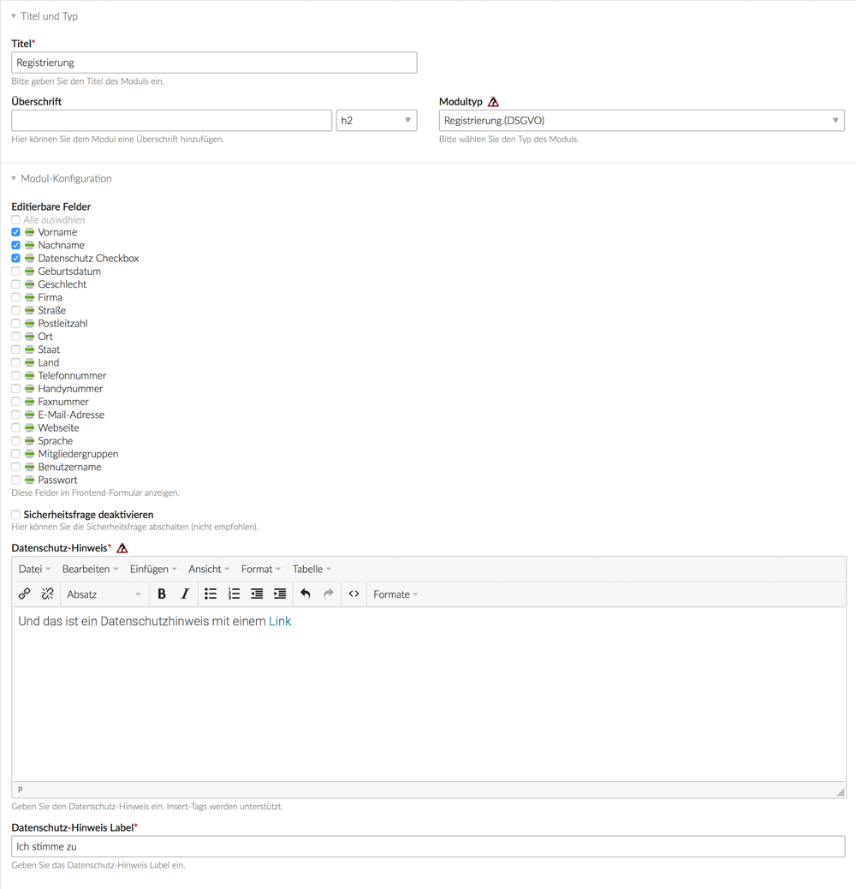
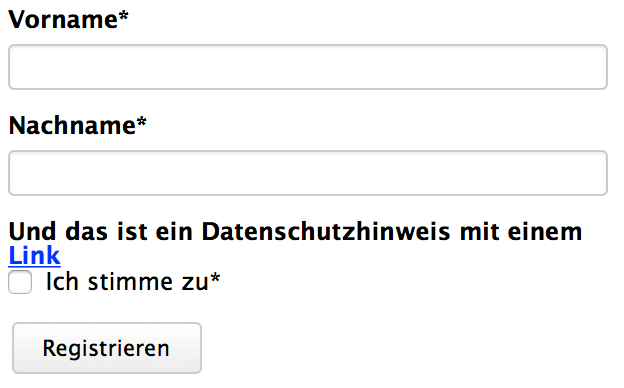
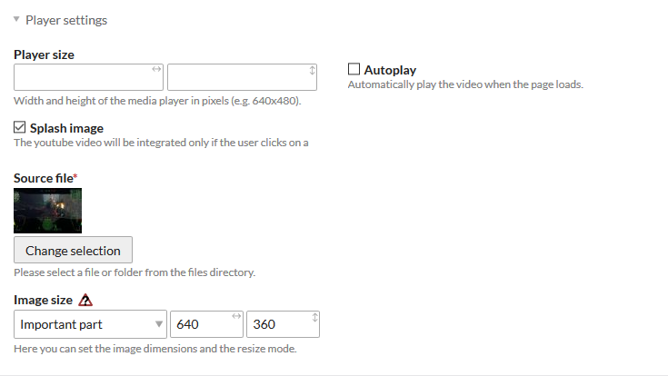

# Contao Privacy

## About

This extension provides some privacy features to Contao 3.5.x and 4.4.x (4.5.x). If you have some ideas which we should add or change in the mentioned Contao versions, feel free to create an [issue](https://github.com/friends-of-contao/contao-privacy/issues).

We would be pleased, if you could help us with ideas, code snippets or maybe with a small sum of money (> 50 € net). You also can join the project for active working on the features. Please send us an [email](mailto:nick@hofff.com) if you want to help us.

## Integrations

### New registration module (GDPR)

Adds a privacy policy consent registration module with checkbox and individual legend and label text.

 

### Hook

The `addPrivacyWidget` hook is executed when a user opens the privacy overview page in backend.
Extension developers can simply add informations to the overview page.

    // config.php
    $GLOBALS['TL_HOOKS']['addPrivacyWidget'][] = array('MyClass', 'myAddPrivacyWidget');
    
    // MyClass.php
    public function myAddPrivacyWidget($arrWidgets)
    {
        // Any Code
    }

Example data for widget

        $arrWidgets[] = array(
            'title' => 'friends-of-contao/contao-privacy',
            'content' => 'Es werden keine datenschutzrelevanten Informationen erhoben.',
            'class' => 'green icon'
        );

You can use green, red, orange and gray in widget class for highlighting.

### Video Splash Image for YouTube and Vimeo

We added an option for YouTube and Vimeo to add a splash image before loading the video.



### Analytics opt-out

Provides an "opt-out" button via a front end module. This button simply sets (or removes) an `analyticsOptOut` cookie, which you can then use in your `analytics_*` templates (or anywhere else) like this for example:
```php
 <?php 

use Foc\ContaoPrivacyBundle\Modules\AnalyticsOptOut;

if (!BE_USER_LOGGED_IN && !$this->hasAuthenticatedBackendUser() && !\Input::cookie(AnalyticsOptOut::COOKIE_NAME)): ?>

  <!-- your tracking script -->

<?php endif; ?>
```
Optionally this module also allows you to remove all cookies for this domain, with the exception of some pre-defined cookies like the session cookie (if active) or a custom list of cookies to keep.

### YouTube no-cookie

Added a checkbox to the YouTube module to switch between standard and no-cookie embedment variant.

## Copyright

This project has been created and is maintained by [friends-of-contao](https://github.com/friends-of-contao)

## Thank you

[christianbarkowsky](https://github.com/christianbarkowsky) - [BRKWSKY](https://brkwsky.de) - donating code and ideas

[fritzmg](https://github.com/fritzmg) - [Wiesmüller & Gschwantner OG](https://www.inspiredminds.at) - donating code and ideas

[MDevster](https://github.com/MDevster) - [pdir GmbH](https://pdir.de) - donating code and ideas

[davidmaack](https://github.com/davidmaack) - [MEN AT WORK Werbeagentur GmbH](https://www.men-at-work.de) - donating code and ideas

[leofeyer](https://github.com/leofeyer) - [Feyer Media GmbH & Co. KG](https://hostingwerk.de) - donating code and ideas

[frontendschlampe](https://github.com/frontendschlampe) - [hofff.com](https://www.hofff.com) - donating ideas and management tasks

[Pellinger](https://github.com/Pellinger) - [twobox.com](http://www.twobox.com) - donating 50 € net

anonym - donating 100 € net

If you want to extend the list, feel free to send us an [email](mailto:nick@hofff.com).

