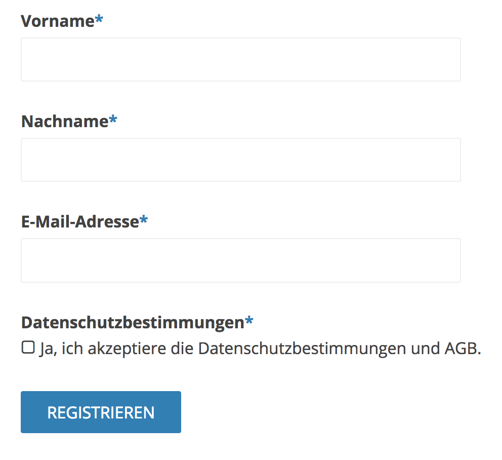

# Contao Privacy

## About

This extension provides some privacy features to Contao 3.5.x and 4.4.x (4.5.x). If you have some ideas which we should add or change in the mentioned Contao versions, feel free to create an [issue](https://github.com/friends-of-contao/contao-privacy/issues).

We would be pleased, if you could help us with ideas, code snippets or maybe with a small sum of money (> 50 € net). You also can join the project for active working on the features. Please send us an [email](mailto:nick@hofff.com) if you want to help us.

## Integrations

### Privacy Policy checkbox for registration

Adds a privacy policy consent checkbox to the registration

### Hook

The addPrivacyWidget hook is executed when a user opens the privacy overview page in backend.
Extension developers can simply add informations to the overview page.

    // config.php
    $GLOBALS['TL_HOOKS']['addPrivacyWidget'][] = array('MyClass', 'myAddPrivacyWidget');

    // MyClass.php
    public function myAddPrivacyWidget($arrWidgets)
    {
        // Any Code
    }

Example data for widget

        $arrWidgets[] = array(
            'title' => 'friends-of-contao/contao-privacy',
            'content' => 'Es werden keine datenschutzrelevanten Informationen erhoben.',
            'class' => 'green icon'
        );

You can use green, red, orange and gray in widget class for highlighting.

## Copyright

This project has been created and is maintained by [friends-of-contao](https://github.com/friends-of-contao)

## Thank you

[christianbarkowsky](https://github.com/christianbarkowsky) - [BRKWSKY](https://brkwsky.de) - donating code and ideas

[davidmaack](https://github.com/davidmaack) - [MEN AT WORK Werbeagentur GmbH](https://www.men-at-work.de) - donating code and ideas

[MDevster](https://github.com/MDevster) - [pdir GmbH](https://pdir.de) - donating code and ideas

[leofeyer](https://github.com/leofeyer) - [Feyer Media GmbH & Co. KG](https://hostingwerk.de) - donating code and ideas

[frontendschlampe](https://github.com/frontendschlampe) - [hofff.com](https://www.hofff.com) - donating ideas and management tasks

[Pellinger](https://github.com/Pellinger) - [twobox.com](http://www.twobox.com) - donating 50 € net

If you want to extend the list, feel free to send us an [email](mailto:nick@hofff.com).

